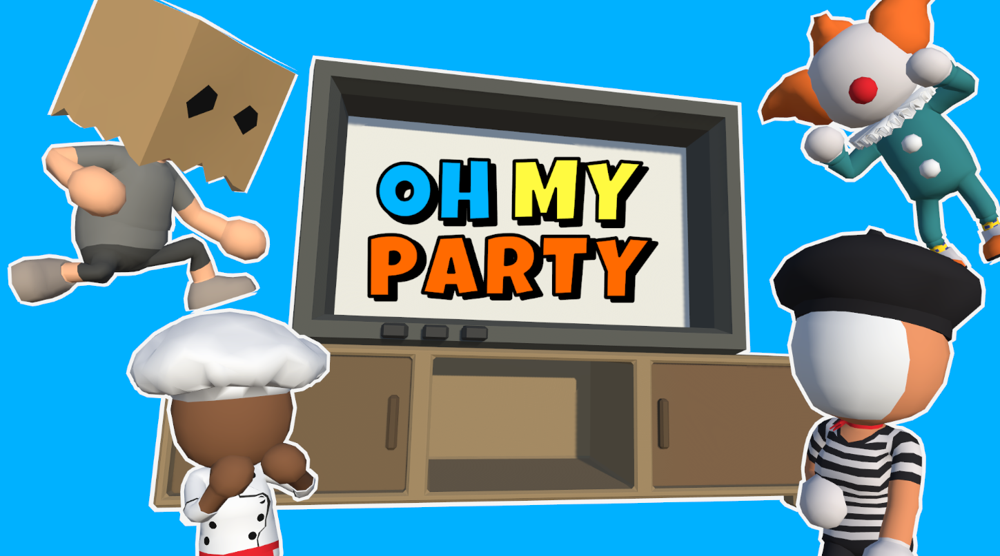

# OH MY PARTY
   
* 기간 : 2024.04 ~ 진행 중
* 인원 : 5인 (프로그래밍 3명, 연출 1명, QA 1명)
* 개발 툴, 언어 : Unity, C#
* 플랫폼 : PC

## 팀원 소개
|팀원|직군|작업 내용|
|:---:|:---:|:---:|
|박세훈|팀장, 프로그래머|Netcode를 활용한 멀티플레이 게임 구조 설계, 미니게임 구조 설계, 미니게임 제작 및 동기화|
|임준성|프로그래머|캐릭터 구조 설계, UI 구현, 플레이어 및 UI 동기화|
|김지성|프로그래머|미니게임 제작 및 동기화|
|곽석현|연출|미니게임 인트로 제작|
|이수현|QA|버그 파악|

## 게임 소개
OH MY PARTY는 4명의 플레이어가 온라인으로 플레이하는 멀티 플레이어 파티 게임입니다.   
쉽고 간단하지만 결코 지루하지 않은 미니 게임 속으로 들어가 우정 파괴 대전을 펼치세요!      
졸업 작품으로 제작한 게임으로 “재미있는 게임”을 만들고자 하는 친구들과 팀을 꾸려 제작하였습니다. 유저들간의 상호작용에서 느낄 수 있는 재미를 중점으로 두어 제작하였습니다.
